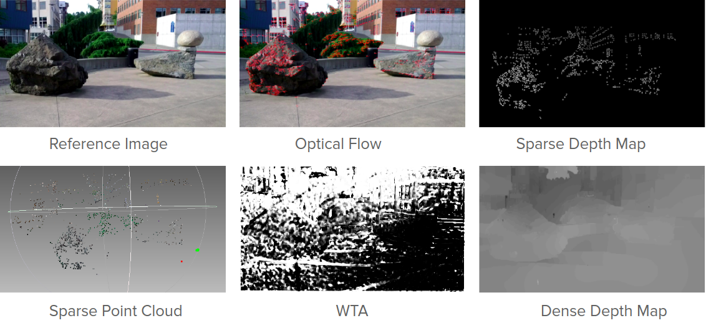

# 3D Reconstruction from accidental motion

Reconstructs a 3D scene by generating a dense depth map from a set of images capturing a scene.

The algorithm first uses **KLT Tracking** to track features across all images. We use **Bundle Adjustment** using the Ceres Solver and estimate the extrinsic camera parameters. Finally, we solve a smooth dense map using a **DenseCRF** formulation.

#### Building Ceres Solver
- `mkdir ceres-bin`
- `cd ceres-bin`
- `cmake ../ceres-solver-1.11.0/`
- `make -j4`
or
- `bash recompile.sh`

#### Install dependencies and requirements
- `pip install -r requirements.txt`

#### Running KLT tracking and Bundle Adjustment
- `cd src`
- `python main.py`

#### Running DenseCRF
- `python dense_crf.py --min_d 2 --max_d 4 --scale 2 --patch_rad 1 --iters 100 --p_std 3,3 --c_std 20,20,20 --wt 1 --max_p 0.15 --folder stone4 --nsamples 64 --show_wta`

- If plane sweeping is already computed for the scene, add the flag `--pc <path-to-npz>`

#### Outputs
- `cd outputs`

#### Building DenseCRF package
- `cd src`
- `chmod +x src/pydensecrf_setup.sh`
- `./pydensecrf_setup.sh`  

**Note**: Make sure `Cython` is installed before running the above commands.

#### Dataset Location
- Download the dataset from [here](https://umich.box.com/shared/static/bnqgx0an4v1b0ioq80sejb7rfiuku8iy.zip) and store it in ./datasets

#### TODO
- [x] KLT
- [x] Filtering Good Points
- [x] Bundle Adjustment
- [x] CRF Energy Minimization
- [x] Integration
